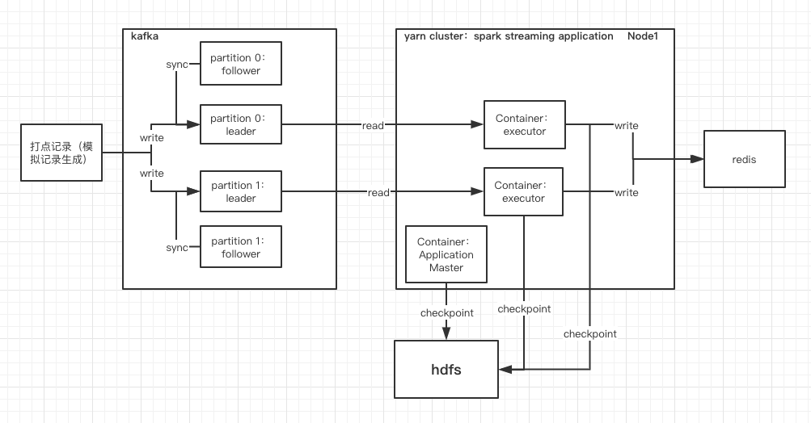
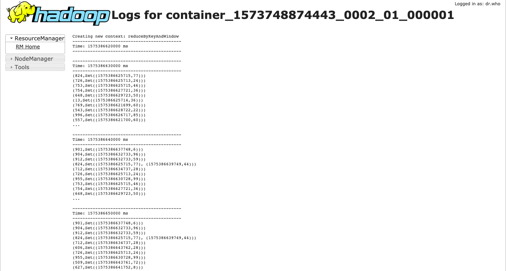
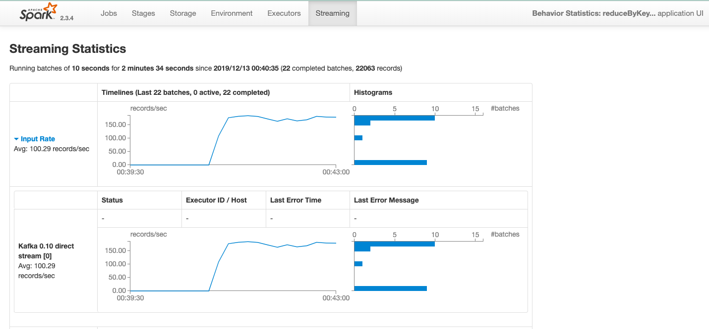

# 用户行为统计

> 通过spark streaming实时读取kafka产生的用户行为日志，统计一段时间内的用户点击行为，并且定时更新

架构图大致如下：


## 运行模拟数据产生器

1.向kafka导入数据  

- 在BehavioralStatisticsGenerator目录编译，pkg clean install
- 运行`./generate.sh`
- 查看有没生成对应的topic，${kafka_dir}/bin/kafka-topics.sh --list --bootstrap-server localhost:9092
- 运行`bin/kafka-console-consumer.sh --bootstrap-server localhost:9092 --topic test_behavior --from-beginning`，结果如下：

```
1574953308844    9    51
1574953308854    72    95
1574953308854    34    60
1574953308854    6    81
1574953308859    25    29
1574953308867    99    60
1574953308867    27    39
1574953308867    89    7
1574953308868    65    5
1574953308868    84    76
1574953308876    96    64
1574953308878    7    58
1574953308878    44    31
1574953308884    31    59
1574953308884    7    94

ps:第一列表示unix时间戳，第二列表示用户id，第三列表示商品代号
```

2.尝试用scala从kafka中读取数据：  

- 在BehavioralStatisticsGenerator目录编译，pkg clean install。 运行 `./consumer.sh`
- 输出类似以下的日志说明能够正常从kafka消费数据：

```
offset = 8252676, key = 29, value = 1575811082426       29      91
offset = 8252677, key = 432, value = 1575811082426      432     50
offset = 8252678, key = 795, value = 1575811082426      795     80
offset = 8252679, key = 701, value = 1575811082426      701     53
offset = 8252680, key = 315, value = 1575811082438      315     36
offset = 8252681, key = 327, value = 1575811082438      327     39
offset = 8252682, key = 757, value = 1575811082438      757     29
```

- 也可以用kafka-console-consumer.sh读取数据 `bin/kafka-console-consumer.sh --bootstrap-server localhost:9092 --topic test_behavior --from-beginning`

3.查看consumer group以及详情  

```
  bin/kafka-consumer-groups.sh --bootstrap-server 127.0.0.1:9092 --list
  bin/kafka-consumer-groups.sh --bootstrap-server 127.0.0.1:9092 --group test_behavior_group --describe
```

## 运行用户行为统计demo

- 在 BehavioralStatistics 目录编译，pkg clean install
- 在修改`./run2_yarn_cluster.sh`的master地址后，直接运行
- 在yarn中web端中，默认地址为`http://localhost:8088`，查看提交的程序，如果containter的stderr日志没报错，则执行成功
- 观察非Application Master的container stdout输出，会定时从kafka读取统计数据并维护一定时间内的用户点击记录。
- 由于进行了checkpoint，如果不需要以前的checkpoint数据，可以删除hdfs上的数据，如：`hadoop fs -rm -r -f /user/gzzhangqilong2017/BehavioralStatistics/tmp`。如果需要退出yarn cluster的application，则执行`yarn application -kill ${application}`
- 以下是正常运行时的部分截图：





